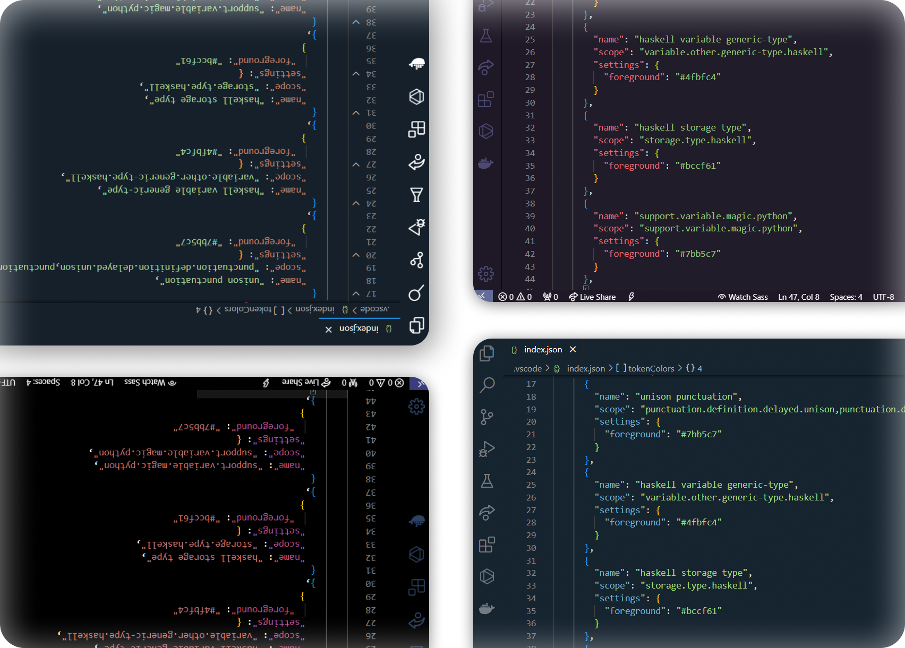
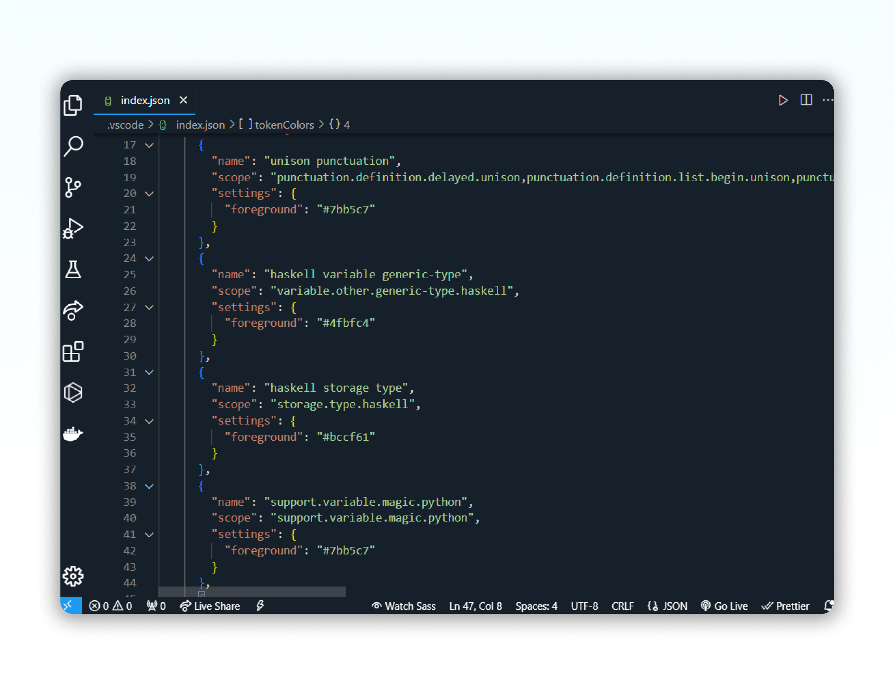
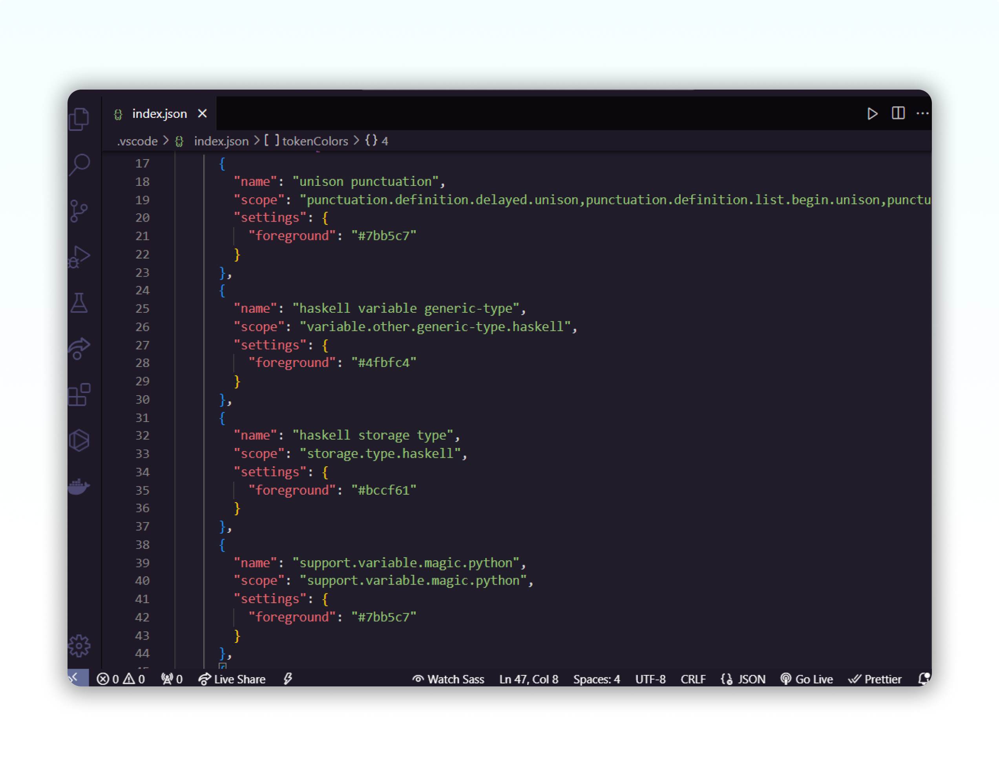

# Zora

 A dark theme for VSCode.

## Installation

- Open the Extensions view: Use the shortcut Ctrl+Shift+X (Windows/Linux) or Cmd+Shift+X (Mac).
- Search for theme: In the search bar at the top, type "Zora".
- Install the theme: Click the "Install" button next to the theme you want.
- Once installed, Navigate to File > Preferences > Color Theme > or Use the shortcut Ctrl+T Ctrl+K(Windows/Linux) or Cmd+K Cmd+T (Mac) to  open this menu. Select the theme you want to use from the list.

Enjoy using it!
